### Hi there 👋
<picture>
  <source media="(prefers-color-scheme: dark)" srcset="./profile/stats-dark.svg?v=48200">
  
</picture>

<picture>
  <source media="(prefers-color-scheme: dark)" srcset="./profile/languages-dark.svg">
  
</picture>

### My contributing projects

| Projects | Description | status |
| :---- | :--- | :--- |
| PixArt🖌️ | First Text-to-Image Diffusion Transformer Model |  |
| SANA⚡️ | First Efficient Diffusion Transformer with Linear Attention and Deep Compression Autoencoder, including Image Gen, Video Gen and Few-step Distillation |  |
| diffusers🧨 | Most popular diffusion open-source community [#23 Contributor](https://github.com/huggingface/diffusers/graphs/contributors) |  |

- 🔭 I’m currently working on AIGC, Foundation Models, Autonomy System, etc.
- 🌱Know more about me: https://lawrence-cj.github.io/
- 📫 How to reach me: cjs1020440147@icloud.com

<!--
**lawrence-cj/lawrence-cj** is a ✨ _special_ ✨ repository because its `README.md` (this file) appears on your GitHub profile.

Here are some ideas to get you started:

- 🔭 I’m currently working on ...
- 🌱 I’m currently learning ...
- 👯 I’m looking to collaborate on ...
- 🤔 I’m looking for help with ...
- 💬 Ask me about ...
- 📫 How to reach me: ...
- 😄 Pronouns: ...
- ⚡ Fun fact: ...
-->
