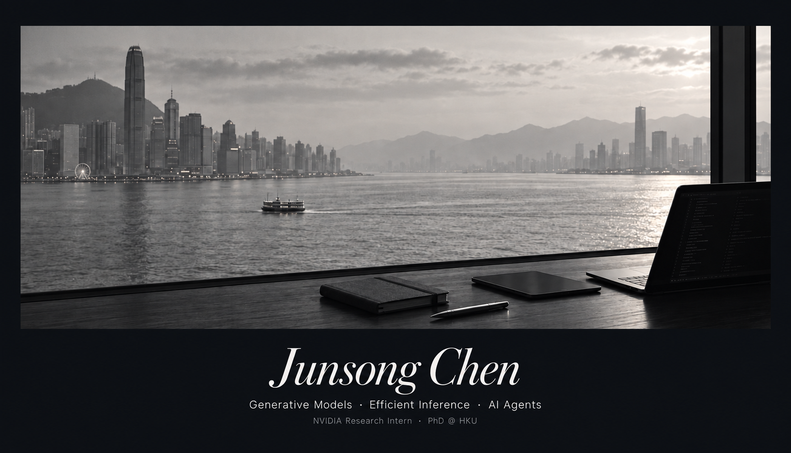

  

  <a href="https://junsongc.top/">Home</a> &nbsp; / &nbsp;
  <a href="https://scholar.google.com/citations?user=p4zxPP8AAAAJ">Papers</a>

  I work on efficient generative models for images and video, 
  from model design and distillation to inference systems and kernels.

<picture>
  <source media="(prefers-color-scheme: dark)" srcset="./profile/stats-dark.svg?v=49052">
  
</picture>

<picture>
  <source media="(prefers-color-scheme: dark)" srcset="./profile/languages-dark.svg">
  
</picture>

### My contributing projects

| Projects | Description | status |
| :---- | :--- | :--- |
| PixArt🖌️ | First Text-to-Image Diffusion Transformer Model |  |
| SANA⚡️ | First Efficient Diffusion Transformer with Linear Attention and Deep Compression Autoencoder, including Image Gen, Video Gen and Few-step Distillation |  |
| diffusers🧨 | Most popular diffusion open-source community [#23 Contributor](https://github.com/huggingface/diffusers/graphs/contributors) |  |
